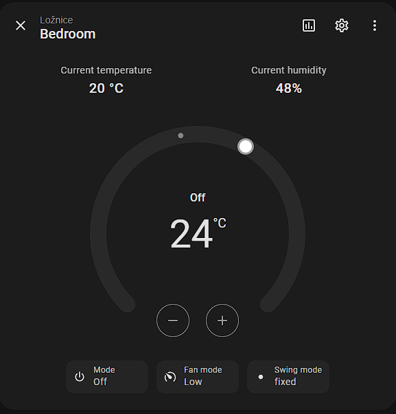
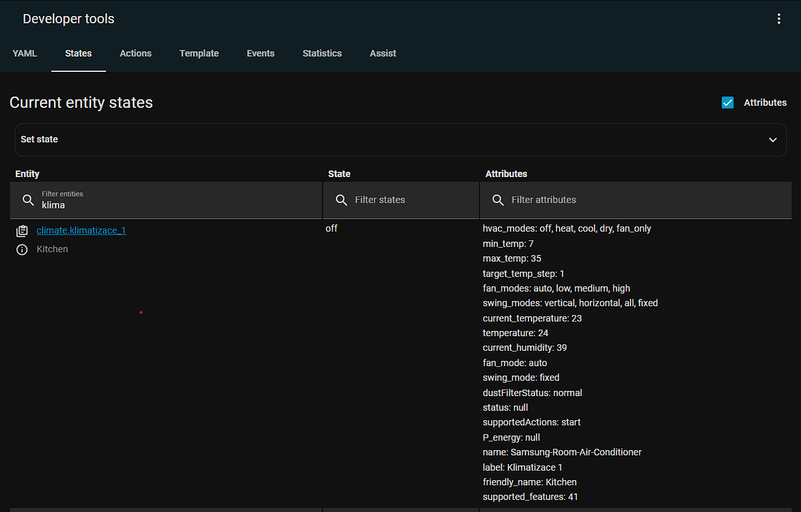

# Home-Assistant-Samsung-Air-Conditioner-Windfree
Home Assistant custom integration for controll Samsung air conditioner Windfree based on IoT Smartthings account.

Is needed Smartthings account with active personal access token (PAT) from [here](https://account.smartthings.com/login?redirect=https%3A%2F%2Faccount.smartthings.com%2Ftokens)

PAT is interpreted like: xxxxxxxx-xxxx-xxxx-xxxx-xxxxxxxxxxxx

## How to get device ID

Is recommended to use Python 3.12.

### Windows
Firstly in downloaded repository run [preprare_env.bat](preprare_env.bat) to create isolated virtual environment.

After run [get_device_id.bat](get_device_id.bat) and you will be asked to insert PAT. Running script you will get all devices ID in your Smartthings account.

```shell
c:\Users\User\Downloads\Home-Assistant-Samsung-Air-Conditioner-Windfree>get_device_id.bat

c:\Users\User\Downloads\Home-Assistant-Samsung-Air-Conditioner-Windfree>call .venv\Scripts\activate
Zadej SmartThings token: xxxxxxxx-xxxx-xxxx-xxxx-xxxxxxxxxxxx
Name: Klimatizace 3
ID:   12345678-aaaa-bbbb-cccc-123456789abc
----------------------------------------
Name: Klimatizace 2
ID:   12345678-aaaa-bbbb-cccc-123456789abc
----------------------------------------
Name: Klimatizace 1
ID:   12345678-aaaa-bbbb-cccc-123456789abc
----------------------------------------
Press any key to continue . . .

```

### Linux
In linux scripts ([preprare_env.sh](preprare_env.sh) and [get_device_id.sh](get_device_id.sh)) must be made as executable:
```bash
chmod +x preprare_env.sh
chmod +x get_device_id.sh
```

And the continue in same way like in Windows.
```bash
testuser@ubuntu:~/test_env# ./preprare_env.sh

testuser@ubuntu:~/test_env# ./get_device_id.sh
Zadej SmartThings token: xxxxxxxx-xxxx-xxxx-xxxx-xxxxxxxxxxxx
Name: Klimatizace 3
ID:   12345678-aaaa-bbbb-cccc-123456789abc
----------------------------------------
Name: Klimatizace 2
ID:   12345678-aaaa-bbbb-cccc-123456789abc
----------------------------------------
Name: Klimatizace 1
ID:   12345678-aaaa-bbbb-cccc-123456789abc
----------------------------------------
```

## How to add into Home assistant
Copy whole folder mysmartthings into config/custom_components, add into configuration.yaml also.

like: config/custom_components/mysmartthings

## configuration.yaml
```yaml
mysmartthings:
  token: "xxxxxxxx-xxxx-xxxx-xxxx-xxxxxxxxxxxx"
  devices:
    - device_id: "xxxxxxxx-xxxx-xxxx-xxxx-xxxxxxxxxxxx"
      name: "Kitchen"
      unique_id: "air_conditioner_1"

    - device_id: "xxxxxxxx-xxxx-xxxx-xxxx-xxxxxxxxxxxx"
      name: "Children room"
      unique_id: "air_conditioner_2"

    - device_id: "xxxxxxxx-xxxx-xxxx-xxxx-xxxxxxxxxxxx"
      name: "Living room"
      unique_id: "air_conditioner_3"
```

## Supported features

__Controll modes__: Off, Fan only, Dry, Cool, Heat

__Fan mode__: Auto, Low, Medium, High

__Swing mode__: Vertical, Horizontal, all, fixed.

## Usage

### Climate entity example



### Entity states example

